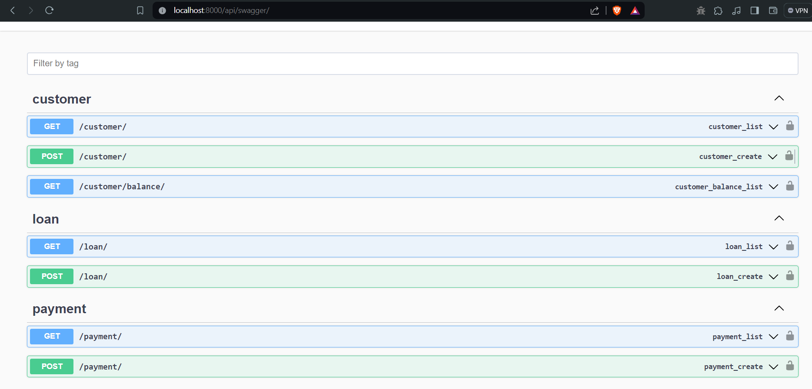
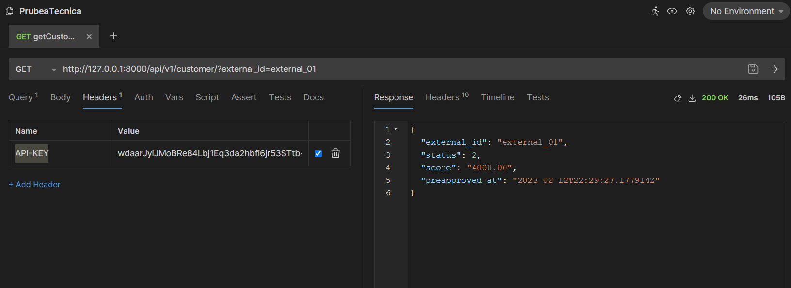

# Waremo Technical Test Backend Developer
All requirements were completed.

1. Customer endpoints
2. Loan Endpoints
3. Pyament and Payment Detail Endpints.

## Swagger

## Postman

### Setting up
`git clone https://github.com/Berckbel/backendapp.git
`
`python -m  venv env-prueba`
`source env-prueba/bin/activate`
`python -m pip install -r requirements.txt`

###### Or you just can use docker : )

###### You can follow me in linkedin and my personal web
[Berckbel](http://www.berckbel.com "Berckbel")
[Linkedin](http://www.linkedin.com/in/raul-mogollon-49a24a278 "Linkedin")
